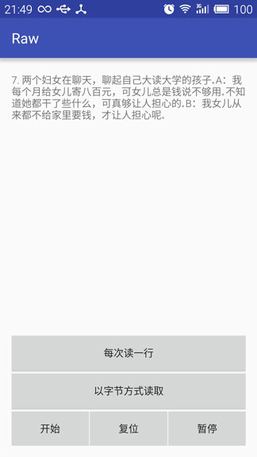

Android 资源文件
============

assets和raw目录中资源的区别
------------------

### 相同点

* 在打包生成的apk中两者目录下的文件都保持原始的文件格式，不会被编译成二进制。

### 不同点

* res/raw中的文件会被映射到R.Java文件中，访问时直接使用资源ID即R.raw.filename，而assets目录下的文件不会被映射到R.java中，访问时需借助AssetManager类。
* res/raw目录下不可以有目录结构，而assets则可以有目录结构，即assets目录下可以再创建子目录。

**注意：**

* assets目录是存放不进行编译加工的原生文件，即该文件夹里面的文件不会像xml和java文件被预编译，可以存放一些image、html、js、css等文件。
* ~~Google的Android系统处理Assert有个bug，在AssertManager中不能处理单个超过1MB的文件，不然会报异常，raw没这个限制可以放个4MB的Mp3文件没问题。~~ ([了解更多][1])

[1]: http://ponystyle.com/blog/2010/03/26/dealing-with-asset-compression-in-android-apps/

assets和raw目录中资源的访问
------------------

### 读取res/raw目录下的资源文件linewalker.mp3，通过以下方式获取输入流来进行写操作：

```java
InputStream is = getResources().openRawResource(R.raw.linewalker.mp3);
```


* res/raw/vocabulary.md中的内容如下：


```
*	######	[*A*pple](#a "苹果")
*	######	[*B*lackberry](#b "黑莓")
*	######	[*C*oconut](#c "椰子")
*	######	[*D*urian](#d "榴莲")
*	######	[*E*lder berry](#e "接骨木果")
*	######	[*F*ig](#f "无花果")
*	######	[*G*rape](#g "葡萄")
*	######	[*H*oney-dew melon](#h "哈密瓜")
*	######	[*I*yokan](#i "伊予柑")
*	######	[*J*uicy peach](#j "水蜜桃")
*	######	[*K*iwi](#k "奇异果")
```

使用以每次读取一行的方式来读取整个文件：

```
public String getResourceFromRawByReadLine(int resId) {
    InputStreamReader inputReader = null;
    BufferedReader bufReader = null;
    String result = "";
    try {
        inputReader = new InputStreamReader(getResources().openRawResource(resId));
        bufReader = new BufferedReader(inputReader);
        String line;
        while ((line = bufReader.readLine()) != null) {
            result += line + "\n";
        }
    } catch (IOException e) {
        e.printStackTrace();
    } finally {
        try {
            if (inputReader != null) {
                inputReader.close();
            }
            if (bufReader != null) {
                bufReader.close();
            }
        } catch (IOException e) {
            e.printStackTrace();
        }
    }
    return result;
}
```

显示结果：


* res/raw/vocabulary.md中的内容如下：

```
7. 两个妇女在聊天，聊起自己大读大学的孩子。A：我每个月给女儿寄八百元，可女儿总是钱说不够用。不知道她都干了些什么，可真够让人担心的。B：我女儿从来都不给家里要钱，才让人担心呢。
```

使用以每次读取一个字节的方式来读取整个文件：

```
public String getResourceFromRawByReadByte(int resId) {
    String result = "";
    InputStream in = null;
    ByteArrayOutputStream bos = null;
    try {
        in = getResources().openRawResource(resId);
        bos = new ByteArrayOutputStream();
        byte[] buffer = new byte[10 * 1024];    // 10kB
        int len;
        while ((len = in.read(buffer)) != -1) {
            bos.write(buffer, 0, len);
        }
        result = bos.toString();
    } catch (IOException e) {
        e.printStackTrace();
    } finally {
        try {
            if (in != null) {
                in.close();
            }
            if (bos != null) {
                bos.close();
            }
        } catch (IOException e) {
            e.printStackTrace();
        }
    }
    return result;
}
```

显示结果：



* res/raw/中有traveling_light.mp3资源文件，使用R.raw.traveling_light的方式来读取文件：

使用资源文件id来初始化MediaPlayer：

```
public void initMediaPlayer(int resId) {
    mMediaPlayer = MediaPlayer.create(this, resId);
    mMediaPlayer.setOnCompletionListener(new MediaPlayer.OnCompletionListener() {
        @Override
        public void onCompletion(MediaPlayer mp) {
            isCompletion = true;
        }
    });
}
```

显示效果：


### 读取assets目录下的文件资源health.txt，通过以下方式获取输入流来进行写操作：

```java
InputStream is = getResources().getAssets().open("health.txt");
```
or
```java
AssetManager am = getAssets();  
InputStream is = am.open("health.txt");  
```

* assets/health.txt的部分内容如下：

```
1 、巧用牙膏:若有小面积皮肤损伤或烧伤、烫伤，抹上少许牙膏，可立即止血止痛，也可防止感染，疗效颇佳。  

2 、巧除纱窗油腻:可将洗衣粉、吸烟剩下的烟头一起放在水里，待溶解后，拿来擦玻璃窗、纱窗，效果均不错。  

3 、将虾仁放入碗内，加一点精盐、食用碱粉，用手抓搓一会儿后用清水浸泡，然后再用清水洗净，这样能使炒出的虾仁透明如水晶，爽嫩可口。  

4 、和饺子面的窍门1:在1斤面粉里掺入6个蛋清，使面里蛋白质增加，包的饺子下锅后蛋白质会很快凝固收缩，饺子起锅后收水快，不易粘连  

5 、将残茶叶浸入水中数天后，浇在植物根部，可促进植物生长；把残茶叶晒干，放到厕所或沟渠里燃熏，可消除恶臭，具有驱除蚊蝇的功能。  
...
```

使用读字节流的方式来读取文件的全部内容并显示：
```
public String getResourceFromAssets(String fileName){
    String result = "";
    InputStream in = null;
    try {
        in = getResources().getAssets().open(fileName);
        byte[] data = readRawFromStream(in);
        if(data != null) {
            result = new String(data);
        }
    } catch (Exception e) {
        e.printStackTrace();
    } finally {
        try {
            if(in != null) {
                in.close();
            }
        } catch (IOException e) {
            e.printStackTrace();
        }
    }
    return result;
}

public static byte[] readRawFromStream(InputStream fis) {
    byte[] result = null;
    ByteArrayOutputStream bos = null;
    try {
        bos = new ByteArrayOutputStream();
        byte[] buffer = new byte[10 * 1024];        // 10kB
        int len;
        while ((len = fis.read(buffer)) != -1) {
            bos.write(buffer, 0, len);
        }
        result = bos.toByteArray();
    } catch (IOException e) {
        e.printStackTrace();
    } finally {
        try {
            if (bos != null) {
                bos.close();
            }
        } catch (IOException e) {
            e.printStackTrace();
        }
    }
    return result;
}
```

调用getResourceFromAssets函数来读取assets/health.txt：

```
mContentTextView = (TextView) findViewById(R.id.tv_content);
mContentTextView.setText(getResourceFromAssets("health.txt"));
```

显示结果：


HTML字符实体的引用
----------------

* 首先在values/strings.xml中保存对应的HTML字符实体的实体编号

```xml
<string name="text_item">项目</string>
<string name="text_number">数值</string>
<string name="text_unit">单位</string>
<string name="text_temp">温度</string>
<string name="text_price">价格</string>

<!--HTML Character Entities-->
<string name="html_char_yen">&#165;</string>
<string name="html_char_deg">&#176;</string>
```

* 然后在activity中进行string资源的引用

```java
mTempTv.setText(R.string.text_temp);
float tempNumber = 26.8f;
String tempNumberString = String.format(Locale.getDefault(), "%.1f", tempNumber);
mTempNumberTv.setText(tempNumberString);
String char_deg = getResources().getString(R.string.html_char_deg) + "C";
mTempUnitTv.setText(char_deg);

mPriceTv.setText(R.string.text_price);
float priceNumber = 99.88f;
String priceNumberString = String.format(Locale.getDefault(), "%.2f", priceNumber);
mPriceNumberTv.setText(priceNumberString);
String char_yen = getResources().getString(R.string.html_char_yen);
mPriceUnitTv.setText(char_yen);
```

* 效果显示


### 常用的HTML字符转义查询：

* 详见附件[doc/xhtml.chm][doc_html]
* [在线HTML转义字符常见对照表][html_entity]

[doc_html]: ./doc/xhtml.chm
[html_entity]: http://tool.oschina.net/commons?type=2

**注意：**

* 引用定义在res/values/strings.xml的单引号字符资源或者其HTML字符实体编号资源时，需要进行转义，否则会报错

```xml
<string name="html_char_apos">\&#39;</string>
<string name="chat_welcome">I\'m pixie, and very glad to serve you.</string>
```

Android字符串国际化
-------------

* 将工程面板切换至工程显示模式，选中res目录右键选择New/Android resource directory，创建指定语言为中文的目录values-zh-rCN

* 然后选择values/strings.xml右键复制copy，再选择values-zh-rCN目录右键粘贴paste即可：


两个文件的内容如下：

values/strings.xml

```xml
<resources>
    <string name="app_name">I18N</string>

    <string name="text_show">Show</string>
    <string name="text_content">Confidence of success is almost success.</string>
</resources>
```

values-zh-rCN/strings.xml

```xml
<resources>
    <string name="app_name">国际化</string>

    <string name="text_show">显示</string>
    <string name="text_content">对成功抱有信心，就近乎成功。</string>
</resources>
```

* 最后切换手机的系统语言设置即可查看国际化效果


### 语言代码表查询：
* 详见附件[doc/Language_Code_Table.pdf][lang_code_pdf]
* [在线语言代码表][lang_code_htm]

[lang_code_pdf]: ./doc/Language_Code_Table.pdf
[lang_code_htm]: http://www.lingoes.cn/zh/translator/langcode.htm